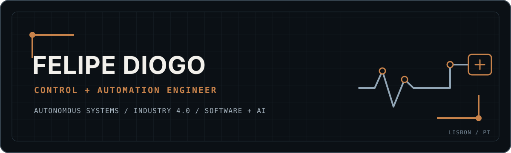

  

  <a href="https://0xfelipegd.com">Portfolio</a> &nbsp;/&nbsp;
  <a href="https://www.linkedin.com/in/felipegdiogo/">LinkedIn</a> &nbsp;/&nbsp;
  <a href="https://github.com/0xFelipeGD">GitHub</a>

## Engineering profile

I am a Control and Automation Engineer based in Lisbon, with more than seven years of experience across industrial automation, autonomous vehicles and software systems.

My work connects physical equipment to dependable software. I have delivered industrial machines, led UGV and UAV engineering teams, designed power and control systems, integrated LiDAR, GNSS and cameras, and built the applications and data platforms used to operate and understand those systems.

Today I work primarily across autonomous systems, Industry 4.0, edge computing, data and applied AI. I am comfortable moving from an electrical schematic or field diagnostic to Python services, ROS 2 nodes, container infrastructure and operator interfaces.

<table>
  <tr>
    <td width="33%" valign="top">
      <strong>Autonomous systems</strong>  
      UGV architecture, by-wire control, power electronics, safety interlocks, teleoperation, LiDAR, GNSS, cameras and embedded computing.
    </td>
    <td width="33%" valign="top">
      <strong>Industry 4.0</strong>  
      PLC and SCADA systems, IT/OT integration, industrial protocols, IIoT data paths, commissioning and production-grade observability.
    </td>
    <td width="33%" valign="top">
      <strong>Software, data and AI</strong>  
      Python and TypeScript applications, APIs, time-series platforms, edge computer vision, automation workflows and LLM-enabled products.
    </td>
  </tr>
</table>

## Selected engineering work

| System | Scope | Engineering focus |
|---|---|---|
| **CEROS UGV control platform** | Private production software for a real tracked UGV | ROS 2 on NVIDIA Jetson, cross-platform Electron operator station, WebRTC video, LiDAR, GNSS/RTK, telemetry, missions, automations and safety-aware remote control |
| **MOV industrial data platform** | Edge-to-cloud monitoring and analytics for industrial assets | MQTT/TLS, Telegraf, InfluxDB, Grafana, Python analytics, Docker, CI/CD, hardened VPS deployment and natural-language reporting |
| **MLAI edge vision station** | Offline visual inspection for industrial and agricultural use cases | TensorFlow/TFLite, PaDiM anomaly detection, OpenCV, FastAPI, WebSockets, SQLite and a SCADA-style web interface on Raspberry Pi |
| **[Julius](https://julius-psi.vercel.app)** | AI-assisted personal finance PWA | Next.js, TypeScript, Supabase/PostgreSQL, OpenAI API, structured extraction and interactive financial dashboards |

Most robotics and industrial repositories are private because they contain real hardware integration, infrastructure details or commercial engineering work. Public projects and deeper case studies are available through my [portfolio](https://0xfelipegd.com).

## Technical range

| Area | Tools and systems |
|---|---|
| Control and robotics | ROS 2, motion control, CAN, LiDAR, GNSS/RTK, WebRTC, MQTT, Raspberry Pi, ESP32, NVIDIA Jetson |
| Industrial automation | TIA Portal, CODESYS, SCADA/HMI, Modbus, Profinet, EtherCAT, OPC UA, Node-RED, EPLAN, AutoCAD |
| Software engineering | Python, TypeScript, JavaScript, Bash, C/C++, FastAPI, Node.js, React, Next.js, Electron, REST, WebSockets |
| Data and infrastructure | PostgreSQL, SQLite, InfluxDB, pandas, Docker Compose, Linux, Nginx, systemd, GitHub Actions, Grafana |
| AI and computer vision | OpenCV, TensorFlow, TFLite, Anomalib/PaDiM, edge inference, LLM APIs and agent-assisted engineering workflows |

## Experience

| Period | Role | Focus |
|---|---|---|
| 2025 - present | Founder and Engineer, Movewer Technologies | Autonomous vehicles, Industry 4.0 platforms, edge AI and end-to-end engineering delivery |
| 2024 - 2025 | Automation and UGV Engineering Manager, Psyche Aerospace | Built and led a five-person engineering function across agricultural UGV and UAV programs |
| 2018 - 2024 | Technician and Automation Engineer, Controvale | Delivered industrial machines, electrical systems, PLC/SCADA projects and field commissioning for more than 35 client relationships |

## Current direction

I am interested in engineering roles where robotics, industrial systems and modern software meet. The strongest fit is work involving autonomous platforms, real-time control, edge computing, Industry 4.0, data infrastructure or applied AI.

Based in Lisbon, Portugal. Open to relocation within Europe or the United States.
